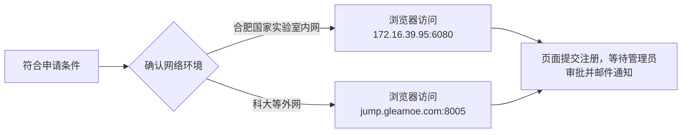
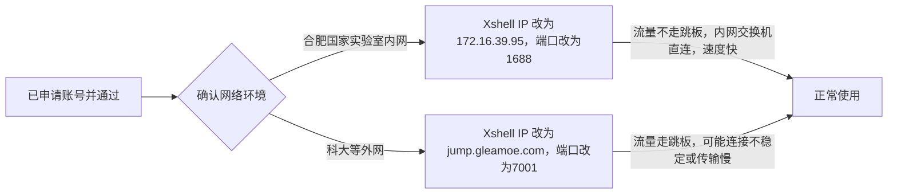

## 1. 用户注册

### 申请条件

1. 杨金龙老师、胡伟老师组内在读硕士和博士生都可申请；
2. 已毕业学生无法申请；
3. 账户名用真实姓名拼音便于审核，长时间未通过联系管理员孟鑫勇。

### 申请流程

---

## 2. 用户登陆

---

## 3.用户使用

1. 使用`module av`查看可用环境变量，使用`sinfo`查看可用的分区和节点信息；
2. 可以通过网页`172.16.39.95:6080/jump.gleamoe.com:8005`便捷监控作业情况；
3. 集群共有`36`个计算节点，各节点`128`核，`503 GB` 内存，默认联网；
4. 由于现阶段用户较少，暂未限制提交作业数；
5. 使用外网跳板机连接的用户，为了网络安全跳板机限制了IP属地和最大尝试次数：

    | **IP属地**      | **10分钟内最大尝试次数** | **后果** |
    | :----:  | :----: | :----: |
    | 安徽合肥 | 20    | 封禁✘  |
    | 除合肥外国内   | 10    | 封禁✘  |
    | 国外   | 0    | 直接封禁✘  |

    如怀疑IP被封禁，请尝试使用其他合肥市内IP，误封请联系管理员马欢解封；
6. 由于合肥实验室未配备UPS（应急电源），请用户每个月自行备份重要数据，防止断电损坏。
